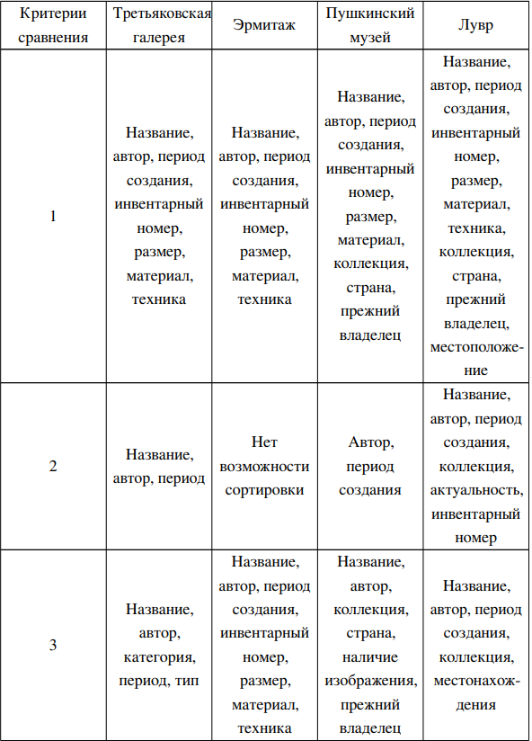
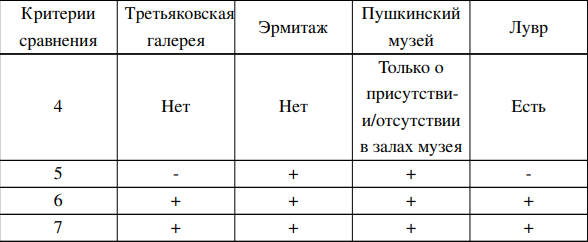
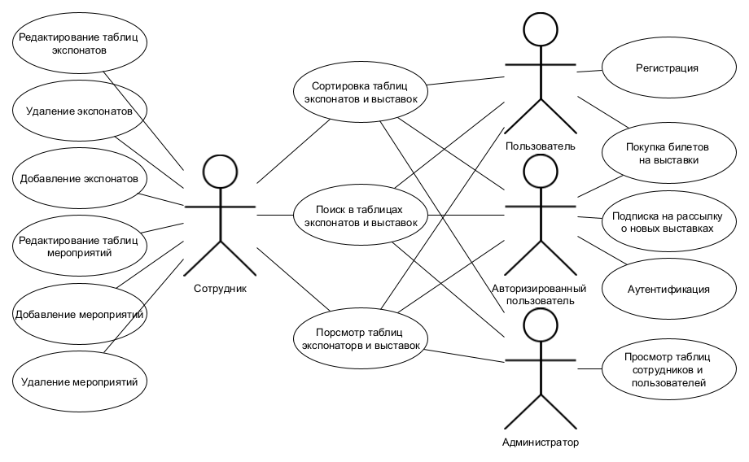
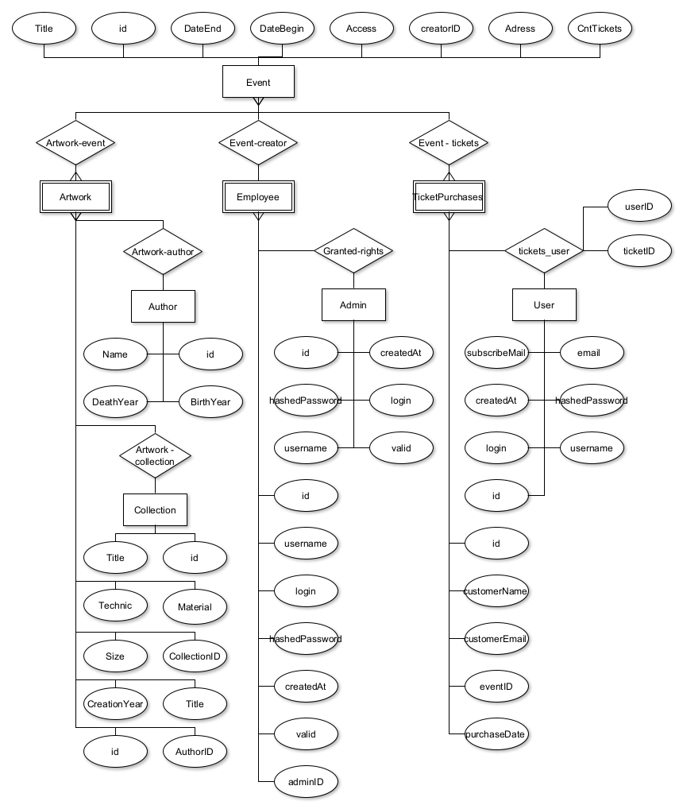
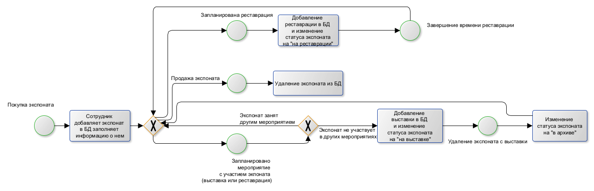
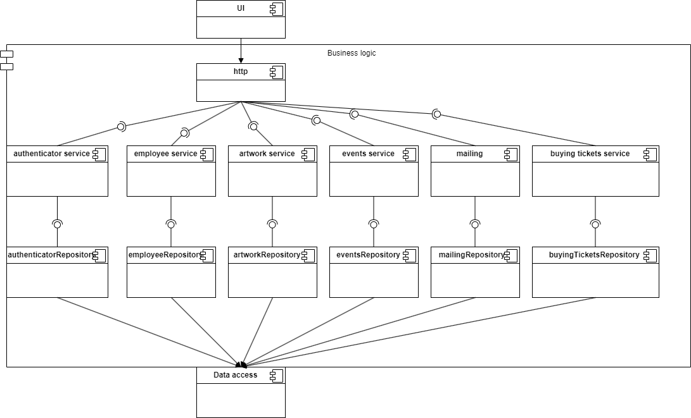
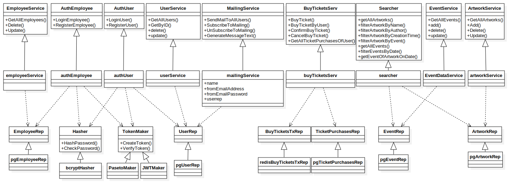
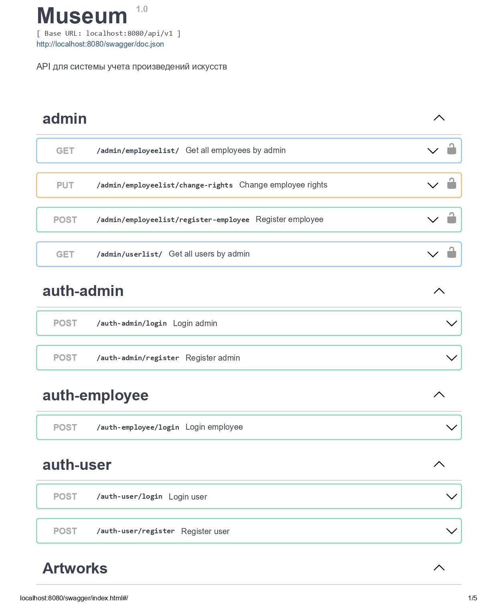
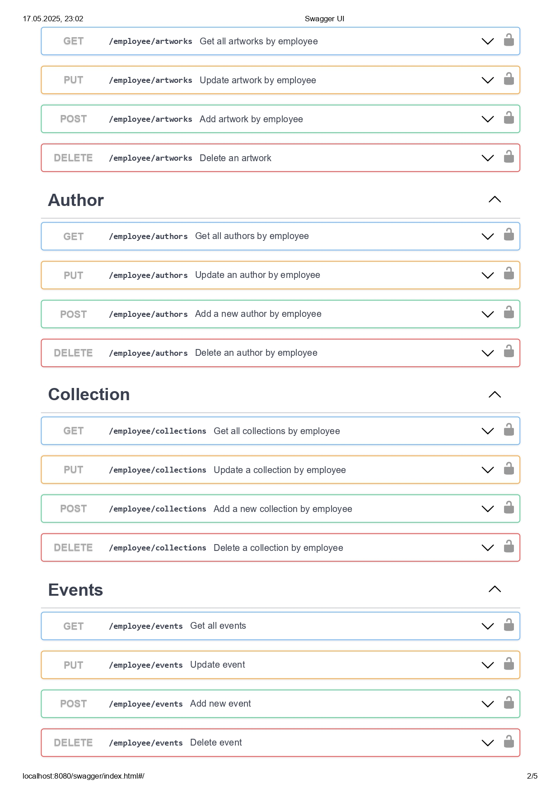
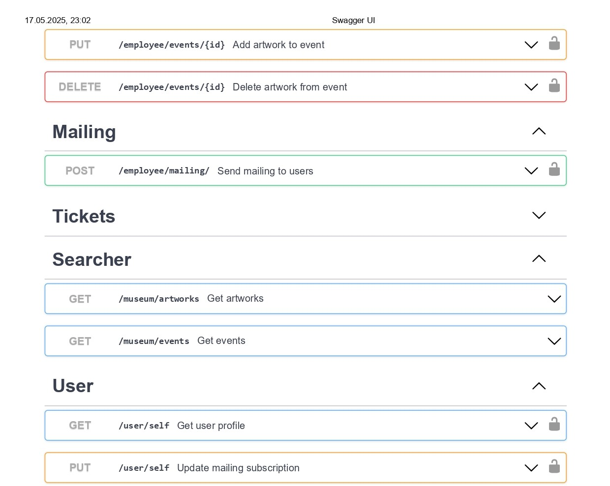

## Документация

[http://localhost:8080/swagger/index.html](http://localhost:8080/swagger/index.html)

## Запуск

```bash
cd deployment/
make dev_up
```

## 1. Название проекта;
Система учета произведений искусства

## 2. Краткое описание идеи проекта (1 абзац, 3 предложения);
Система учета произведений искусства у собственника (как частное лицо так и музей), с возможностью отслеживания информации о местонахождении экспонатов, участия их в своих и сторонних выставках и продажи билетов. 


## 3. Краткое описание предметной области (1 абзац);
Предметная область - хранение данных о произведениях искусства. 


## 4. Краткий анализ аналогичных решений по минимум 3 критериям (1 таблица);
Аналоги представленны в виде информации на сайте Третьяковской галереи, Пушкинского музея, Лувра.

### Третьяковская галерея

На сайте Третьяковской галереи можно посмотреть в общем списке информацию об имеющихся в архиве картинах. Для поиска необходимой работы пользователю предоставляются возможности по сортировке и фильтрации картин, по автору, названию, категории и периоду из выпадающего списка. 

Пользователь может получить информацию о каждой имеющейся в галерее картине: размер, материал, техника, автор, название, год создания, инвентарный номер; и о выставках, которые проходят и будут проходить в самой галерее. Также он может купить билет на одну из этих выставок.

### Пушкинский музей

На сайте Пушкинского музея можно посмотреть в общем списке информацию о хранящихся в нем экспонатах, главными характеристиками которых можно выделить название, коллекцию, автора, страну, год создания, размер, материал, прежнего владельца, музейный номер. По некоторым из данных характеристик возможно осуществление фильтрации (коллекция, автор, страна, прежний владелец) и сортировки (автор, год создания). Также пользователь может получить информацию о наличии произведения искусства в музее в данный момент. И он может посмотреть перечень выставок проходящих в музее по датам и приобрести билеты на них.


### Эрмитаж

На сайте Эрмитажа не представлен общий список имеющихся произведений искусства, экспонаты разбиты на категории внутри, которых возможен поиск по всех доступным на сайте характеристикам объектов искусства, из них главными можно выделить: название, автор, размер, техника, материал, период создания, инвентарный номер. Сортировка экспонатов по каким-либо параметрам не доступна.

На сайте пользователь может получить информацию о выставках, которые проходят или будут проходить, как в Эрмитаже, так и в других музеях, в которых участвуют картины из его коллекции. Также пользователь может приобрести билеты на выставки Эрмитажа.


### Лувр

На сайте Лувра пользователь может увидеть список имеющихся произведений искусства и их характеристики. Основным можно выделить название, автор, период создания, инвентарный номер, размер, материал, техника, коллекция, страна, прежний владелец, местоположение объекта на момент обновления базы данных.

Пользователь может сортировать экспонаты по названию, автору, дате создания, коллекции, инвентарному номеру и актуальности. Также он может осуществлять фильтрацию по названию, автору, периоду создания, коллекции и месту нахождения.

На сайте можно увидеть выставки, проходящие в данный момент в музее и купить на них билеты. Информации о предстоящих выставках нет.

Для сравнения описанных выше аналогов хранилищ произведений искусства были выбраны критерии:

1. характеристики произведений искусства представленные на сайте;
2. параметры сортировки экспонатов;	
3. параметры фильтрации экспонатов;	
4. наличие информации о местоположении картин;	
5. наличие информации о предстоящих выставках;	
6. наличие информации о текущих выставках;
7. возможность приобретения билетов на выставки;




## 5. Краткое обоснование целесообразности и актуальности проекта (1 абзац);
Создание системы учета экспонатов находящихся в небольших частных коллекциях и распространения информации об их участии в сторонних выставках. С возможностью подписки на рассылку о новых выставках. 

## 6. Краткое описание акторов (ролей);
База данных предназначена для сотрудников музея, администратора, авторизованных и неавторизованных пользователей. 

Пользователи будут использовать разрабатываемое приложение для поиска экспонатов хранящихся в музее, получения информации о них и покупки билетов. 

Авторизированные пользователи будут иметь возможность подписаться на рассылку о новых выставках музея. 

Сотрудники будут иметь возможность добавлять, редактировать  экспоната и мероприятия, в которых они участвуют, например, выставки или реставрации. 

Администратор будет отвечать за данные о сотрудниках и удаление информации о выставках и экспонатах из базы данных. 

## 7. Use-Case - диаграмма (обратить внимание на UML нотацию, отразить разных акторов пересечение их возможностей в приложении); 



## 8. ER-диаграмма сущностей (не путать с диаграммой БД – диаграмма сущность-связь не приземлена на конкретную СУБД и показывает сущности системы, в том числе те, которые не будут персистентно храниться);




##  9. Пользовательские сценарии (не менее 3 типовых сценариев, в текстовом виде, расписанных по шагам, для разных акторов);

Пользователь: смотрит имеющиеся в коллекции произведения искусства, их местоположение и на основе этого выбирает выставку, которую хочет посетить;

Авторизированный пользователь: то же самое + подписывается на рассылку о новых выставках;

Сотрудник: заносит информацию о новых экспонатах, изменяет ее при необходимости и удаляет записи об экспонатах при их продаже, назначает реставрацию экспонатов, заносит информацию о выставках (датах проведения и экспонатах которые в них участвуют);

Администратор: руководит информацией о сотрудниках;

## 10. Формализация ключевых бизнес-процессов (либо один основной комплексный бизнес процесс, либо 3-4 декомпозированных, небольших, используя BPMN-нотацию).



 
 ## Описание типа приложения и выбранного технологического стека

- backend: Go, gin, squirrel, paseto, gswaggo
- test: testify, testcontainers
- frontend: Web MPA
- БД: PostgreSQL, redis

 ## Верхнеуровневое разбиение на компоненты

 На базовом уровне выделяем компонент доступа к данным, компонент бизнес-логики и компонент реализации UI. Отобразить диаграммой компонентов. Подумать про принцип инверсии зависимостей

<!--  -->


 ## UML диаграммы классов для двух отдельных компонентов
 Компонента UI -- 
MV*-подобного паттерна (MVC, MTV, MVP, MVVM, MVPVM, MVI и др.).



## Swagger






  

