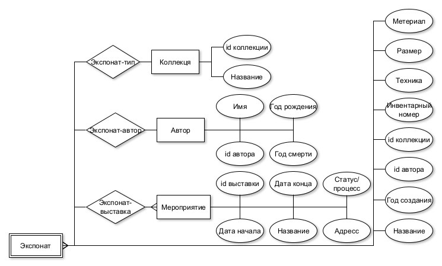

## 1. Название проекта;
Система учета произведений искусства

## 2. Краткое описание идеи проекта (1 абзац, 3 предложения);
Система учета произведений искусства у собственника (как частное лицо так и музей), с возможностью отслеживания информации о местонахождении экспонатов, участия их в своих и сторонних выставках и продажа билетов. 

--- 

База данных, которая содержит информация о произведениях искусства хранящится в музее и о выставках, которые проводятся в нем и в которых участвуют экпонаты. Основная идея - хранение информации о предметах искусства находящится в архиве музея.

## 3. Краткое описание предметной области (1 абзац);
Предметная область - хранение данных о произведениях искусства. 

## 4. Краткий анализ аналогичных решений по минимум 3 критериям (1 таблица);
Аналоги представленны в виде информации на сайте Третьяковской галереи, Пушкинского музея, Лувра.

### Третьяковская галерея

В Третьяковской галерее представлено более 8 тысяч произведений искусства, информацию о которых можно посмотреть на сайте. Для поиска необходимой работы пользователю предоставляются возможности по сортировке и фильтрации картин, по автору, названию, категории и периоду из выпадающего списка. 

Пользователь может получить информацию о каждой имеющейся в галерее картине (размер, материал, техника, автор, год создания, инвентарный номер) и о выставках, которые проходят и будут проходить в самой галерее.

### Пушкинский музей

На сайте Пушкинского музея представлена информация о хранящихся в нем экспонатах, их авторах и коллекциях, также есть возможность фильтрации и сортировки по ним из выпадающего списка. Помимо этого пользователь может получить информацию о наличии произведения искусства в музее в данный момент. На отдельной вкладке он может посмотреть перечень выставок и событий проходящих в музее по датам.

### Эрмитаж

На сайте Эрмитажа не представлен общий список имеющихся произведений искусства, экспонаты разбиты на категории внутри, которых возможен поиск по названию, технике, автору, материалу, дате создания и т. д. Причем каждый параметр вводится текстом, а не выбирается из выпадающего списка, что может быть неудобно.

На сайте пользователь может получить информацию о выставках, которые проходят или будут проходить, как в Эрмитаже, так и в других музеях, в которых участвуют картины из коллекции Эрмитажа.

### Лувр

На сайте Лувра представлен список имеющихся произведений искусства, есть возмножность их сортировки и фильтрации по коллекции, автору, названию, времени создания и т. д. Для каждого экспоната представлена полная информация о нем, включая местоположение объекта на момент обновления базы данных.

Пользователь на сайте может увидеть только выставки и события, проходящие в данный момент в музее и нет информации о предстоящих.

Для сравнения описанных выше аналогов хранилищ произведений искусства были выбраны критерии:

1. возможность увидеть полную информацию о  произведении искусства;
2. параметры сортировки экспонатов;
3. параметры фильтрации экспонатов;
4. возможность покупки билетов на выставки;
5. возможность спонсорства (программа “Друг музея”);
6. наличие информации о местоположении картин;
8. наличие информации о текущих выставках;
8. наличие информации о предстоящих выставках;
9. наличие выпадающего списка в фильтрах;

## 5. Краткое обоснование целесообразности и актуальности проекта (1 абзац);
Создание системы учета (по типу 1C (он дорогой и здесь не будет системы налогового учета)) экспонатов находящихся в небольших частных коллекциях и распространения информации об их участии в сторонних выставках. С возможностью подписки на рассылку о новых выставках. 

--- 

Актуальностью данного проекта является создание базы данных небольшой частной коллекции, которая удавлетворяет всем выделенным критериям.

## 6. Краткое описание акторов (ролей);
Пользователями базы данных могут являться сотрудники музея, его гости и спонсоры, а также администратор. 

Гости будут использовать разрабатываемое приложение для покупки билетов, поиска экспонатов хранящихся в музее и получения информации о них. Некоторые люди, заинтересованные в продвижении и улучшении музея, могут стать его спонсорами и получить некоторые привилегии.  

Сотрудники музея могут иметь разный уровень доступа. Обычные сотрудники, которые отвечают за организацию выставок в музее, и научные сотрудники, которые занимаются приемом новых экспонатов, их возможной продажей и заполнением информации о проведениях искусства.

Также в базе данных должен присутствовать администратор, который отвечает за информацию о людях

## 7. Use-Case - диаграмма (обратить внимание на UML нотацию, отразить разных акторов пересечение их возможностей в приложении); 

## 8. ER-диаграмма сущностей (не путать с диаграммой БД – диаграмма сущность-связь не приземлена на конкретную СУБД и показывает сущности системы, в том числе те, которые не будут персистентно храниться);

##  9. Пользовательские сценарии (не менее 3 типовых сценариев, в текстовом виде, расписанных по шагам, для разных акторов);

Пользователь: смотрит имеющиеся в коллекции произведения искусства, их местоположение и на основе этого выбирает выставку, которую хочет посетить;

Авторизированный пользователь: то же самое + подписывается на рассылку о новых выставках;

Научный сотрудник: заносит информацию о новых экспонатах, изменяет ее при необходимости и удаляет записи об экспонатах при их продаже, назначает реставрацию экспонатов;

Сотрудник: заносит информацию о выставках (датах проведения и экспонатах которые в них участвуют);

Администратор: руководит информацией о сотрудниках;

## 10. Формализация ключевых бизнес-процессов (либо один основной комплексный бизнес процесс, либо 3-4 декомпозированных, небольших, используя BPMN-нотацию).

 

  

